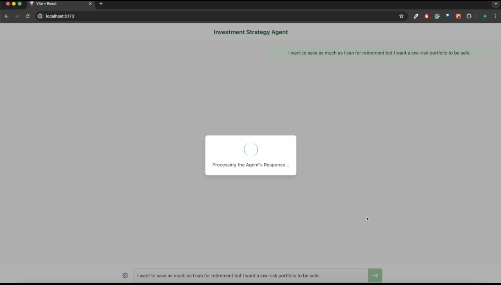

# Investment Strategy Advisor FastAPI Backend

A sophisticated FastAPI backend that generates personalized investment strategies using AI agents and financial data. This API powers the Investment Strategy Agent React frontend.

## Features

- RESTful API built with FastAPI
- AI-powered investment strategy generation
- Multi-agent architecture for specialized financial analysis
- Real-time financial data integration (optional via Alpha Vantage API)
- Feedback processing for strategy refinement

## Architecture

This application implements a multi-agent investment advisor system with the following components:

1. **Goal Creator Agent** - Extracts structured investment goals from natural language input
2. **Financial Data Agent** - Retrieves and analyzes market data (real or simulated)
3. **RAG Agent** - Provides investment options using a knowledge base and vector search
4. **Specialist Agents**:
   - Investment Specialist - Evaluates expected returns and diversification
   - Risk Specialist - Assesses risk profiles and alignment
   - Goal Specialist - Matches investments to specific financial goals
5. **Voting Coordinator Agent** - Finalizes strategy based on specialist recommendations
6. **Presentation Agent** - Formats strategies for user presentation

## Demo Screenshots




## Prerequisites

- Python 3.8+
- FastAPI
- Uvicorn
- Autogen 
- Python-dotenv
- OpenAI API key (for the LLM backend)
- Alpha Vantage API key (optional, for real financial data)

## Installation

1. Clone the repository:

```bash
git clone <repository-url>
cd investment-advisor-api
```

2. Create and activate a virtual environment:

```bash
python -m venv venv
source venv/bin/activate  # On Windows: venv\Scripts\activate
```

3. Install dependencies:

```bash
pip install fastapi uvicorn autogen python-dotenv requests
```

4. Create a `.env` file in the project root with your API keys:

```
OPENAI_API_KEY=your_openai_api_key
OPENAI_MODEL=gpt-3.5-turbo  # or gpt-4 for better results
STOCK_API_KEY=your_alpha_vantage_api_key  # Optional
```

## Directory Structure

Ensure your project has the following structure:

```
investment-advisor-api/
├── main_api.py                # FastAPI main application file
├── agents/                    # Agent modules directory
│   ├── __init__.py
│   ├── goal_creator_agent.py  # Goal extraction agent
│   ├── financial_data_agent.py # Financial data retrieval and analysis
│   ├── rag_agent.py           # Retrieval Augmented Generation agent
│   ├── investment_specialist_agent.py # Investment specialist
│   ├── risk_specialist_agent.py # Risk assessment specialist
│   ├── goal_specialist_agent.py # Goal alignment specialist
│   ├── voting_coordinator_agent.py # Strategy finalizer
│   ├── presentation_agent.py  # User presentation formatter
│   └── feedback_agent.py      # Feedback analysis agent
├── data/                      # Data directory
│   └── investment_knowledge.txt # Investment knowledge base (created automatically)
└── .env                       # Environment variables
```

## Running the Server

Start the FastAPI server with Uvicorn:

```bash
uvicorn main_api:app --reload --host 0.0.0.0 --port 8000
```

The API will be available at `http://localhost:8000`. API documentation is automatically available at:

- Swagger UI: `http://localhost:8000/docs`
- ReDoc: `http://localhost:8000/redoc`

## API Endpoints

### Generate Investment Strategy

```
POST /api/generate-strategy
```

Request body:
```json
{
  "goal_text": "I want to invest for retirement with low risk",
  "risk_tolerance": 1,  // 1=low, 2=medium, 3=high
  "investment_horizon": 20,  // years
  "portfolio_size": 10000  // dollars
}
```

### Process User Feedback

```
POST /api/process-feedback
```

Request body:
```json
{
  "recommendation_id": "rec_123",
  "feedback_text": "I would like less exposure to international markets"
}
```

### Health Check

```
GET /api/health
```

## Financial Data

The system can operate in two modes:

1. **With Alpha Vantage API key**: Uses real-time financial data
2. **Without API key**: Uses simulated financial data

To enable real financial data, set the `STOCK_API_KEY` environment variable with a valid Alpha Vantage API key.

## Customizing the Knowledge Base

You can customize the investment knowledge base by editing `data/investment_knowledge.txt`. This file contains information about various investment options that the system will consider when generating recommendations.

## Testing the API

You can test the API using curl:

```bash
curl -X 'POST' \
  'http://localhost:8000/api/generate-strategy' \
  -H 'accept: application/json' \
  -H 'Content-Type: application/json' \
  -d '{
  "goal_text": "I want to invest for retirement with low risk",
  "risk_tolerance": 1,
  "investment_horizon": 20,
  "portfolio_size": 10000
}'
```

Or use a tool like Postman or the built-in Swagger UI at `http://localhost:8000/docs`.

## Troubleshooting

### Common Issues

1. **OpenAI API errors**: Ensure your API key is valid and has sufficient credits

2. **Agent module errors**: Verify all Python files in the `agents/` directory are present and properly structured

3. **Alpha Vantage API limits**: Be aware that Alpha Vantage free tier has API call limits (typically 5 calls per minute)

### OpenAI Model Selection

You can change the OpenAI model used by updating the `OPENAI_MODEL` variable in the `.env` file. Available options include:
- `gpt-3.5-turbo`: Faster but less sophisticated
- `gpt-4`: Slower but more sophisticated (requires access to GPT-4)

### Logging

The application logs important information to the console. To increase logging verbosity, you can modify the logging level in `main_api.py`:

```python
logging.basicConfig(level=logging.DEBUG)  # Change from INFO to DEBUG
```

## License

[MIT License](LICENSE)
